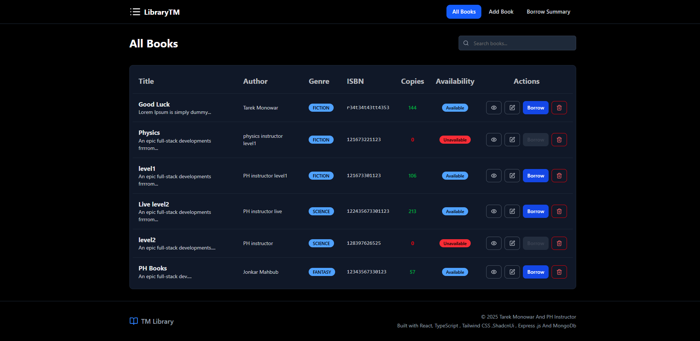

# 📚 Library Management System

A minimal Library Management System built with **React**, **Redux Toolkit Query
(RTK Query)**, and **TypeScript**. This application allows users to manage books
and borrowing records through a clean, responsive interface.

## ✨ Features

- View, add, edit, and delete books
- Borrow books with quantity and due date
- Automatic availability updates based on stock
- Borrow summary with aggregated data
- Responsive design
- Toast notifications for success and errors

---

## Live FronEnd Link

https://assignment-3-three-lilac.vercel.app

---

## Tech Stack

- React ,Redux and RTK
- Tailwind CSS and ShadcnUI
- Node.js & Express.js
- MongoDB with Mongoose ODM
- ES Modules (import/export)
- Middleware: CORS, JSON parsing, error handling

---

 

---

## 🧭 Routes Overview

| Path              | Description                |
| ----------------- | -------------------------- |
| `/`               | Home                       |
| `/books`          | List all books             |
| `/create-book`    | Create a new book          |
| `/books/:id`      | View book details          |
| `/edit-book/:id`  | Edit book information      |
| `/borrow/:bookId` | Borrow a selected book     |
| `/borrow-summary` | View borrowed book summary |
| `*`               | 404 - Not Found            |

## 🚀 Getting Started

### Installation

```bash
# Clone the repository
git clone https://github.com/tarekmonowar/Library-management-frontEnd.git
cd library-management

# Install dependencies
npm install

# Start development server
npm run dev


```
